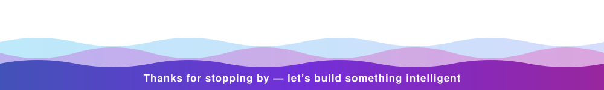

&nbsp;

 

## 🧑‍💻 About me

Backend and AI systems engineer with **7 years** of experience and **3 years building production LLM applications**. I specialise in natural-language interfaces over real data (NL → SQL, NL → DAX, NL → NoSQL and geospatial querying), plus RAG pipelines, distributed task orchestration, ML clustering and forecasting, and on-prem microservices with cloud DevOps on AWS and Azure.

## 📈 Impact in numbers

## 🚀 Things I've shipped

<table>
<tr>
<td width="50%" valign="top">

### 🗺️ Chat with geospatial data
Ask about POIs and land use in plain English. Built on **PostGIS**, a **local LLM** and **MCP** tools, with answers drawn on a map.

</td>
<td width="50%" valign="top">

### 📊 Natural language → DAX
LLM agents with **MCP** that write DAX for **Azure Power BI**. Accuracy went from **20% to 90%** and response time from **16s to 5s**.

</td>
</tr>
<tr>
<td valign="top">

### 💬 Survey analytics copilot
A conversational analytics layer for government survey programmes. It turns questions into **dynamic MongoDB queries** and returns insights, tables, charts and maps. Fully **async**, on an **open-source LLM**.

</td>
<td valign="top">

### 📄 Document intelligence (RAG)
Summarise, retrieve and analyse large volumes of unstructured documents using **RAG**, **rerankers** and foundation models.

</td>
</tr>
<tr>
<td valign="top">

### 🕸️ Distributed scraping platform
**Scrapy + Playwright + Celery** across 4 servers, handling **~1M product records a day** with retry-safe tasks, deduplication and central ingestion.

</td>
<td valign="top">

### 🧠 Classic ML in production
**HDBSCAN** complaint segmentation with scheduled retraining, a retail **demand forecasting** model, and **NL → SQL over Neo4j** with a local LLM.

</td>
</tr>
</table>

## 🛠️ Tech stack

**Languages & AI / ML**

 

**Backend & data**

 

**Cloud & DevOps**

## 🐍 Contribution activity

<picture>
  <source media="(prefers-color-scheme: dark)" srcset="https://raw.githubusercontent.com/AkshayAX/AkshayAX/output/github-snake-dark.svg" />
  <source media="(prefers-color-scheme: light)" srcset="https://raw.githubusercontent.com/AkshayAX/AkshayAX/output/github-snake.svg" />
  
</picture>

 

